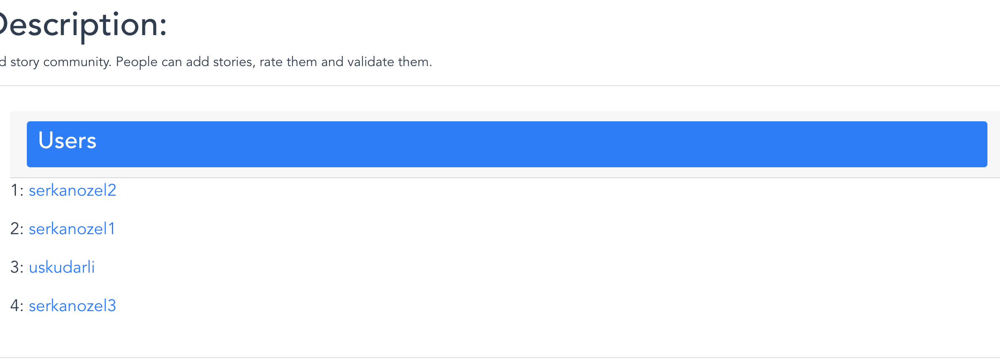

## Decentralized Purposeful Online Community Application Framework Source Code

## To run this project;
  * Install nodejs if you have not already. [Nodejs](https://nodejs.org/en/)
  * Add npm to path. In the Nodejs zip you will find a bin folder. Add it to environment variable PATH.
  * Run `npm i`
  * This can take long. No errors should be present after the command terminates. If you see something like *** packages added after the command ended, you are good to go.
  
  * Run `npm run serve`
  You should see this:
  
  then this: 
  
  
* To deploy to another website, run `npm run build` and deploy dist folder. After the command you should see: 
  

Move the dist folder to your web server to deploy. 

## Usage
* In the main page you see 4 categories Users, Datatypes(The data types users creates in the community), Tasks(Things can you do in the community) and Content(The data that are created). In the main page you will see all users' information collected together.
  
* In your profile page you can see the content that is related to you. You see your tasks, contribution(overall look to your data) and content(individual detailed look to your data)
  
  You see the profile button above. You see profile page below.
  

* Click on cards to expand them for example if I click on users in the main page I see users 
  
* To start a task, go to main page and click tasks. Then click start under the tasks you want to start. Then you can see the notifications that appear in top right region.
  
  After pressing start button: 
  
  After creating a task, if you need to enter some input it is said in the notifications. Go to your profile page. The tasks that are green are the ones that you need to enter your input.
  
  Press enter input to enter input. You will see a pop up that asks the input. 
  
  After adding your input press submit. If you entered everything correct, you will see steps being completed as notifications. 
  
  If you need to input again the task will ask from you again. If not, the task will be complete and do the job it supposed to do. In this case we created a new story. And it is added under "Your contribution"  and "Your content" sections. 
  
  You see above my stories as a list. There is the newly added one there too.  If you click on one of them, you go to the location of it in the Solid pod of the user who created it.

## Troubleshooting
* If you get an error regarding the application cannot fetch something you can try
  * Emptying your browser cache, sometimes redirecting to solid.community for login takes long due to it being cached. For Chrome clearing your cache: 
  
  * Sometimes logging in again solves problems, the login info is cached but it may not be valid anymore. Click logout in the title menu and then click login again.
  